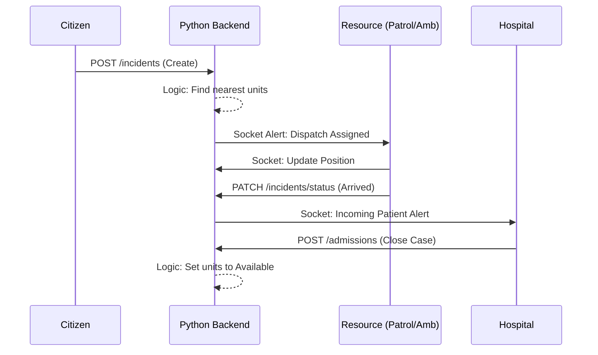

# Software Requirements Specification (SRS)
## Highway Emergency Response Management System (HERMS)

**Version:** 2.0  
**Date:** 2026-02-24

---

### 1. Introduction

#### 1.1 Purpose
The purpose of this document is to provide a comprehensive description of the Highway Emergency Response Management System (HERMS). It outlines the functional and non-functional requirements, external interfaces, and system constraints to guide the development and maintenance of the project.

#### 1.2 Document Conventions
This document follows the IEEE 830-1998 standard for Software Requirements Specifications. Standard markdown is used for formatting.

#### 1.3 Intended Audience and Reading Suggestions
This document is intended for Developers, Stakeholders, and Testers involved in the HERMS ecosystem.

#### 1.4 Project Scope
HERMS is a real-time emergency response platform designed specifically for highway accidents and medical emergencies. It facilitates rapid citizen reporting (SOS), coordinated dispatch of patrol units and ambulances, and real-time bed management in hospitals.

#### 1.5 References
*   IEEE Std 830-1998, IEEE Recommended Practice for Software Requirements Specifications.
*   Python (Flask/FastAPI) Documentation.
*   PostgreSQL Documentation.
*   React/Vite/Tailwind CSS Documentation.

---

### 2. Overall Description

#### 2.1 Product Perspective
HERMS is a distributed web application featuring a centralized Python-based backend (integrating Flask or FastAPI) and a React frontend. It manages real-time data flows for emergency coordination through a persistent database and websocket-based communication.

#### 2.2 Product Functions
*   **Emergency Reporting (SOS):** Citizen reporting with "Shake to SOS".
*   **Resource Management:** Dispatching of Patrol and Ambulance units.
*   **Hospital Coordination:** Real-time bed management and admission.
*   **Real-time Visualization:** Map-based tracking of active incidents.

#### 2.3 User Classes and Characteristics
*   Citizens, Patrol Units, Ambulance Crews, Hospital Staff, and Administrators.

#### 2.4 Operating Environment
*   **Frontend:** Modern web browsers (optimized for mobile).
*   **Backend:** Python 3.x Environment (Flask/FastAPI).
*   **Database:** PostgreSQL.
*   **Infrastructure:** Linux-based servers (Dockerized or AWS/Heroku/DigitalOcean).

#### 2.5 Design and Implementation Constraints
*   Real-time latency requirements, security via JWT/OAuth2, and high-stress UI accessibility.

#### 2.7 Assumptions and Dependencies
*   Reliance on Python backend for data processing and real-time alerts.
*   Mapping services (Leaflet/Mapbox).

---

### 3. External Interface Requirements

#### 3.1 User Interfaces
Modern responsive design with glassmorphism aesthetics.

#### 3.2 Hardware Interfaces
GPS Sensor and Accelerometer on mobile devices.

#### 3.3 Software Interfaces
*   **Backend API:** Python-based REST/Websocket API.
*   **Database:** PostgreSQL for persistent storage.

#### 3.4 Communications Interfaces
*   **Websockets:** Real-time status and GPS updates.
*   **HTTPS:** Secure REST API communication.

---

### 4. System Features

#### 4.1 Feature: Incident Reporting
Functional requirements for capturing geolocation and emergency details.

#### 4.2 Feature: Resource Dispatch & Tracking
Real-time tracking and unit status management.

#### 4.3 Feature: Hospital Bed Management
Dynamic capacity management and incoming patient ETAs.

---

### 5. Other Nonfunctional Requirements

#### 5.1 Performance Requirements
Position updates propagate within 2 seconds via Python-managed sockets.

#### 5.2 Security Requirements
Authentication via JWT (JSON Web Tokens) managed by the Python backend. Permission-based access control (RBAC).

#### 5.3 Software Quality Attributes
Availability (99.9%) and horizontal scalability of the Python application tier.

---

### 6. Technical Requirements

#### 6.1 Database Schema (Partial)
Tables: `incidents`, `hospitals`, `ambulances`, `patrols`, `alerts`.

#### 6.2 Tech Stack
*   **Frontend:** React 18, Vite, Tailwind CSS.
*   **Backend:** Python (Flask/FastAPI), Gunicorn/Uvicorn.
*   **Database:** PostgreSQL.
*   **Real-time:** Socket.io or FastAPI WebSockets.

---

### 7. System Connect Working Structure

#### 7.1 System Architecture Diagram

graph TD
    subgraph "External Nodes"
        Citizen["Citizen (Public SOS)"]
        Patrol["Patrol Unit (Dash)"]
        Ambulance["Ambulance (Dash)"]
        Hospital["Hospital (Panel)"]
    end

    subgraph "Core Backend (Python)"
        API["Python API (Flask/FastAPI)"]
        Socket["Websocket Server"]
        DB[(PostgreSQL DB)]
    end

    Citizen -- "REST Request" --> API
    API -- "CRUD" --> DB
    DB -- "Change Data" --> API
    API -- "Push Event" --> Socket
    Socket -- "Broadcast" --> External Nodes
    
    Ambulance -- "GPS Socket" --> Socket
    Patrol -- "GPS Socket" --> Socket
```

#### 7.2 Core Operational Workflow
The system follows a reactive lifecycle triggered by external events:
1.  **Ingestion:** Citizen SOS -> API POST -> DB Persistence.
2.  **Dispatching:** Backend Logic -> Nearest Resource Identification -> DB Update (Assigned).
3.  **Mobilization:** Resource Client -> State Update -> Navigation Start.
4.  **On-Scene:** Resource Client -> Activity Logs -> Patient Stabilization.
5.  **Coordination:** Resource Client -> Hospital Bed Verification -> Transport Start.
6.  **Handover:** Hospital Panel -> Admission -> Resolution.

#### 7.3 Backend Connectivity Layer
The connection between the React frontend and Python backend is managed through a persistent `EmergencyContext`.
*   **Encapsulation:** All API calls are abstracted into asynchronous methods (e.g., `createIncident`, `assignResources`).
*   **State Hydration:** Initial system state (active incidents, unit positions) is fetched via standard REST `GET` requests upon dashboard initialization.
*   **Interoperability:** The backend provides a unified JSON-based API that ensures consistency across different actor dashboards.

#### 7.4 Real-time Synchronization Protocol
Synchronization is achieved via a dedicated WebSocket layer (Socket.io/FastAPI WebSockets):
*   **Events:**
    *   `incident:new`: Broadcasted to all responders when a citizen reports an emergency.
    *   `unit:position`: Emitted by Patrol/Ambulance units every 5-10 seconds; broadcasted to the tracking map.
    *   `incident:status`: Triggered on status transitions (e.g., DISPATCHED -> ON_SCENE).
*   **Latency Management:** The system optimizes payloads to minimize bandwidth, transmitting only delta changes for coordinates.

#### 7.5 Technical Data Flow (Step-by-Step)
1.  **Reporting:** SOS trigger sends GPS coordinates + metadata. Backend validates and stores.
2.  **Assignment:** The `calculateDistance` (Haversine) logic runs on the server to pair the incident with the single closest 'AVAILABLE' unit.
3.  **Acknowledgement:** Units receive a "Push" notification through the WebSocket. Accepting the assignment updates their internal state to 'BUSY'.
4.  **Navigation:** The frontend uses the system's tracking hook (`useGPSTracking`) to frequently ping the backend with updated coordinates.
5.  **Hospital Alerting:** On transport start, an automated `field_alert` is generated and pushed to the specific Hospital's WebSocket room.

#### 7.6 Failure Mitigation & Edge Cases
*   **Network Interruption:** Responders utilize a local cache of incident data. Updates are queued and synchronized once connectivity is restored.
*   **GPS Inaccuracy:** If GPS data is stale (> 30s), the last known position is marked with a "Warning" icon on the map.
*   **Resource Exhaustion:** If no units are 'AVAILABLE', the incident is queued as 'PENDING' and auto-assigned as soon as a unit resolves a previous case.

---

### 8. Classical UML Diagrams

#### 8.1 Use Case Diagram
(Common to system logic, remained largely unchanged from v1.0).

#### 8.2 Sequence Diagram: Response Flow



#### 8.3 Class Diagram: Data Entities
(Entities remain consistent; implementation moved from Supabase RLS to Python Server logic).

---

### 9. Detailed Operational Procedures (Step-by-Step)

#### 9.1 Citizen (SOS) Workflow
1.  **Access:** Open the HERMS Public Portal on a mobile device.
2.  **Trigger:** Use the "Shake to SOS" gesture or long-press the central SOS button.
3.  **Data Capture:** The system captures high-accuracy GPS coordinates and activates the microphone/camera (if permitted).
4.  **Submission:** The user confirms the emergency type (e.g., Accident, Medical).
5.  **Tracking:** Upon submission, the user is redirected to a "Tracking" screen showing real-time ETA and positions of dispatched resources.

#### 9.2 Patrol Unit Workflow
1.  **Availability:** Login to the Patrol Dashboard and toggle status to 'AVAILABLE'.
2.  **Receipt:** Receive an audible and visual "New Assignment" alert.
3.  **Acceptance:** Review incident location and accept. Status auto-updates to 'EN ROUTE'.
4.  **Arrival:** Upon reaching coordinates, click "ARRIVED ON SCENE". This notifies the control room and Citizen.
5.  **Action:** Secure the area and provide initial situational data.
6.  **Resolution:** Once the scene is clear, click "RESOLVED" to return to an 'AVAILABLE' state.

#### 9.3 Ambulance Unit Workflow
1.  **Dispatch:** Receive assignment based on proximity to the incident.
2.  **Navigation:** Use the integrated Leaflet map for navigation to the specific GPS pin.
3.  **Assessment:** On-scene, the crew enters patient triage data (Critical, Stable, etc.).
4.  **Hospital Selection:** The system suggests the nearest hospital with available beds. The crew confirms the destination.
5.  **Transport:** Clicking "START TRANSPORT" triggers a 'Field Alert' at the target hospital.
6.  **Handoff:** Upon arrival at the ER, the hospital staff confirms admission, marking the ambulance as 'AVAILABLE'.

#### 9.4 Hospital Workflow
1.  **Monitoring:** Staff monitor the "Hospital Panel" for incoming field alerts.
2.  **Preparation:** View patient vitals and ETA provided by the incoming ambulance crew.
3.  **Admission:** When the ambulance arriving, click the "ADMIT" button for the specific incident.
4.  **Capacity:** The system automatically decrements the 'Available Beds' count.
5.  **Administration:** Staff can manually toggle "Hospital Full" status to prevent further auto-dispatches.

#### 9.5 Administrator Oversight
1.  **Global View:** Access the "Admin Dashboard" to see all active incidents across the state.
2.  **Direct Dispatch:** Manually override auto-dispatch decisions if necessary.
3.  **Resource Analytics:** Review response times and hospital utilization rates.

