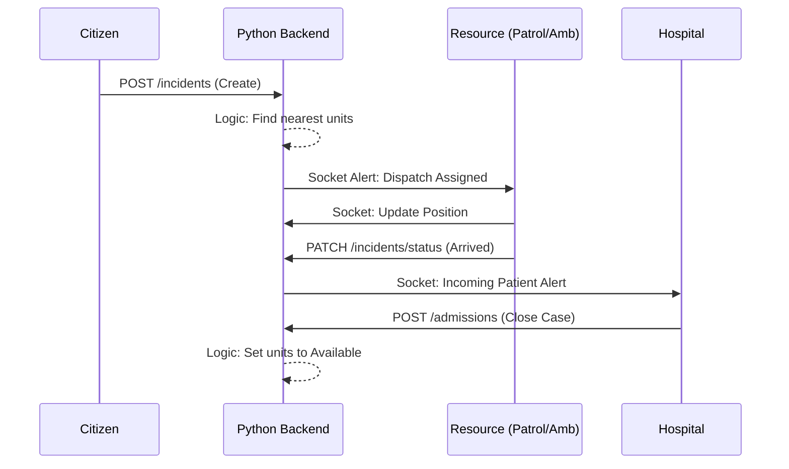

# Software Requirements Specification (SRS)
## Highway Emergency Response Management System (HERMS)

**Version:** 2.0  
**Date:** 2026-02-24

---

### 1. Introduction

#### 1.1 Purpose
The purpose of this document is to provide a comprehensive description of the Highway Emergency Response Management System (HERMS). It outlines the functional and non-functional requirements, external interfaces, and system constraints to guide the development and maintenance of the project.

#### 1.2 Document Conventions
This document follows the IEEE 830-1998 standard for Software Requirements Specifications. Standard markdown is used for formatting.

#### 1.3 Intended Audience and Reading Suggestions
This document is intended for Developers, Stakeholders, and Testers involved in the HERMS ecosystem.

#### 1.4 Project Scope
HERMS is a real-time emergency response platform designed specifically for highway accidents and medical emergencies. It facilitates rapid citizen reporting (SOS), coordinated dispatch of patrol units and ambulances, and real-time bed management in hospitals.

#### 1.5 References
*   IEEE Std 830-1998, IEEE Recommended Practice for Software Requirements Specifications.
*   Python (Flask/FastAPI) Documentation.
*   PostgreSQL Documentation.
*   React/Vite/Tailwind CSS Documentation.

---

### 2. Overall Description

#### 2.1 Product Perspective
HERMS is a distributed web application featuring a centralized Python-based backend (integrating Flask or FastAPI) and a React frontend. It manages real-time data flows for emergency coordination through a persistent database and websocket-based communication.

#### 2.2 Product Functions
*   **Emergency Reporting (SOS):** Citizen reporting with "Shake to SOS".
*   **Resource Management:** Dispatching of Patrol and Ambulance units.
*   **Hospital Coordination:** Real-time bed management and admission.
*   **Real-time Visualization:** Map-based tracking of active incidents.

#### 2.3 User Classes and Characteristics
*   Citizens, Patrol Units, Ambulance Crews, Hospital Staff, and Administrators.

#### 2.4 Operating Environment
*   **Frontend:** Modern web browsers (optimized for mobile).
*   **Backend:** Python 3.x Environment (Flask/FastAPI).
*   **Database:** PostgreSQL.
*   **Infrastructure:** Linux-based servers (Dockerized or AWS/Heroku/DigitalOcean).

#### 2.5 Design and Implementation Constraints
*   Real-time latency requirements, security via JWT/OAuth2, and high-stress UI accessibility.

#### 2.7 Assumptions and Dependencies
*   Reliance on Python backend for data processing and real-time alerts.
*   Mapping services (Leaflet/Mapbox).

---

### 3. External Interface Requirements

#### 3.1 User Interfaces
Modern responsive design with glassmorphism aesthetics.

#### 3.2 Hardware Interfaces
GPS Sensor and Accelerometer on mobile devices.

#### 3.3 Software Interfaces
*   **Backend API:** Python-based REST/Websocket API.
*   **Database:** PostgreSQL for persistent storage.

#### 3.4 Communications Interfaces
*   **Websockets:** Real-time status and GPS updates.
*   **HTTPS:** Secure REST API communication.

---

### 4. System Features

#### 4.1 Feature: Incident Reporting
Functional requirements for capturing geolocation and emergency details.

#### 4.2 Feature: Resource Dispatch & Tracking
Real-time tracking and unit status management.

#### 4.3 Feature: Hospital Bed Management
Dynamic capacity management and incoming patient ETAs.

---

### 5. Other Nonfunctional Requirements

#### 5.1 Performance Requirements
Position updates propagate within 2 seconds via Python-managed sockets.

#### 5.2 Security Requirements
Authentication via JWT (JSON Web Tokens) managed by the Python backend. Permission-based access control (RBAC).

#### 5.3 Software Quality Attributes
Availability (99.9%) and horizontal scalability of the Python application tier.

---

### 6. Technical Requirements

#### 6.1 Database Schema (Partial)
Tables: `incidents`, `hospitals`, `ambulances`, `patrols`, `alerts`.

#### 6.2 Tech Stack
*   **Frontend:** React 18, Vite, Tailwind CSS.
*   **Backend:** Python (Flask/FastAPI), Gunicorn/Uvicorn.
*   **Database:** PostgreSQL.
*   **Real-time:** Socket.io or FastAPI WebSockets.

---

### 7. System Connect Working Structure

#### 7.1 System Architecture Diagram

```mermaid
graph TD
    subgraph "External Nodes"
        Citizen["Citizen (Public SOS)"]
        Patrol["Patrol Unit (Dash)"]
        Ambulance["Ambulance (Dash)"]
        Hospital["Hospital (Panel)"]
    end

    subgraph "Core Backend (Python)"
        API["Python API (Flask/FastAPI)"]
        Socket["Websocket Server"]
        DB[(PostgreSQL DB)]
    end

    Citizen -- "REST Request" --> API
    API -- "CRUD" --> DB
    DB -- "Change Data" --> API
    API -- "Push Event" --> Socket
    Socket -- "Broadcast" --> External Nodes
    
    Ambulance -- "GPS Socket" --> Socket
    Patrol -- "GPS Socket" --> Socket
```

#### 7.2 Working Workflow
1.  **SOS:** Citizen reports incident via POST request to Python API.
2.  **Broadcast:** API saves to DB and triggers Socket.io broadcast to responders.
3.  **Dispatch:** Python backend logic identifies nearest units; updates DB.
4.  **Tracking:** Units push location logs via Websockets; broadcasted to all viewers.
5.  **Resolution:** Final status updates handled via API endpoints; DB persistent storage updated.

---

### 8. Classical UML Diagrams

#### 8.1 Use Case Diagram
(Common to system logic, remained largely unchanged from v1.0).

#### 8.2 Sequence Diagram: Response Flow



#### 8.3 Class Diagram: Data Entities
(Entities remain consistent; implementation moved from Supabase RLS to Python Server logic).
